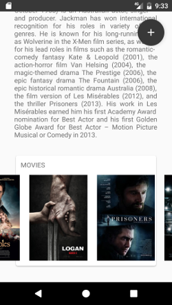

#
android-design : training

This is a design training repository.

Just trying to understand and learn more about Android views by creating some funny User Interfaces. I will credit systematically all authors for theirs *awesome* designs :)

**"User Profile Concept"**  by Nashatwork ( [concept link](https://material.uplabs.com/posts/user-profile-concept) )  
[Project link](https://github.com/worknrole/android-design/tree/master/design/designapp/src/main/java/com/worknrole/design/ui/userprofileconcept) - Custom views, custom styles, Floatingbutton, DrawerLayout, CardView, RecyclerView  

 
